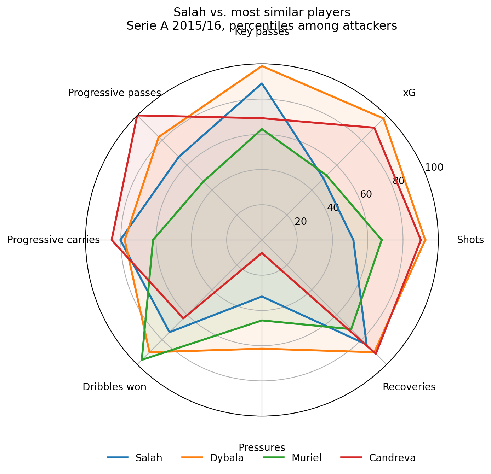

# Finding Similar Players: A Serie A 2015/16 Case Study

A recruitment-analytics project: given a reference player, find the players in the league
whose on-pitch behaviour is most similar.

**Notebook:** [`scout_analytics_football_3.ipynb`](scout_analytics_football_3.ipynb)

## Question

Which Serie A players had a playing profile closest to Mohamed Salah (AS Roma, 2015/16)?

## Data

- StatsBomb Open Data, Serie A 2015/16: all 380 matches, about 1.35 million events.
- Source: [StatsBomb Open Data](https://github.com/statsbomb/open-data)

## Method

1. Collected all match events and computed minutes played per player from starting line-ups
   and substitutions.
2. Built per-90 metrics: passing, progressive passes and carries (actions that move the ball at
   least 10 yards closer to goal), key passes, shots, xG, dribbling, receptions, tackles,
   interceptions, ball recoveries, pressures, average action location, and more.
3. Kept outfield players with 900+ minutes (320 players: 133 defenders, 106 midfielders,
   81 attackers). Players are compared only within their position group.
4. Standardised metrics (z-scores, clipped at ±3) against all players of the same position group,
   then ranked players by cosine similarity.
5. Applied a minutes filter (1,500+) only to the candidate shortlist, so a player's similarity
   score does not change with the threshold.
6. Checked which metrics drive each similarity score. For attackers, clearances and blocks were
   dominating some matches despite being rare actions, so they were excluded (20 metrics remain
   for attackers).

## Result (reference: Mohamed Salah, 1,500+ minutes)

| Player | Team | Similarity |
|---|---|---|
| Paulo Dybala | Juventus | 0.54 |
| Luis Muriel | Sampdoria | 0.48 |
| Antonio Candreva | Lazio | 0.47 |
| Keita Baldé | Lazio | 0.38 |
| Marco Borriello | Atalanta | 0.36 |

*Percentiles among the 81 attackers with 900+ minutes; the radar shows 8 of the metrics used.*

Dybala is the closest profile among players with 1,500+ minutes, and stays in the top 5 when the
threshold is lowered to 1,000 minutes (where lower-minute players rank above him). He follows
Salah's overall shape (chance creation, ball carrying, ball recoveries) at a higher volume.
Muriel and Candreva form a second tier; beyond them similarity drops noticeably.

**Small-sample leads (900+ minutes):** Politano (Sassuolo, 0.61), Tello (Fiorentina, 0.61) and
Jesús Fernández (Genoa, 0.57) show profiles very close to Salah but played only about
1,100–1,250 minutes, so their per-90 numbers are noisy. They would be candidates for a video
check, not a conclusion.

## Validation

- My first version ranked Muriel clearly first (0.61). Breaking down per-metric contributions
  showed that blocks and clearances were doing much of the work, which is noise for attackers.
  After removing them his score dropped to 0.48.
- A threshold test showed that the shortlist changed with the minutes cut-off, because the
  normalisation was recomputed on the filtered sample. Fixing the normalisation to one reference
  group made scores stable across thresholds.

## Limitations

- One season and one league only.
- Event data only: no age, contract, market value, physical or off-ball data.
- Similarity describes playing style, not quality; a transfer decision needs much more.
- Position groups come from the most frequent position label in the data.
- Red cards are ignored in the minutes calculation.
- Candidates at the bottom of the shortlist (e.g. Borriello) may still reflect noise in
  individual metrics.

## Next steps

- Repeat for other positions and for the other full 2015/16 leagues in the open data
  (Premier League, La Liga, Ligue 1).
- Add age and market value to turn the shortlist into a transfer-style report.
- Test other metric sets and similarity measures.

## How to run

Open the notebook in Google Colab and run the cells from top to bottom. The first run downloads
the match data (this takes a while) and caches it on Google Drive; later runs reuse the cache.

## Data attribution

Data provided by StatsBomb. https://github.com/statsbomb/open-data

